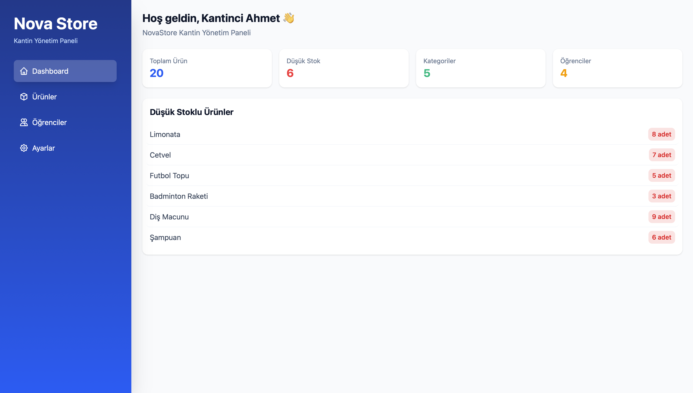
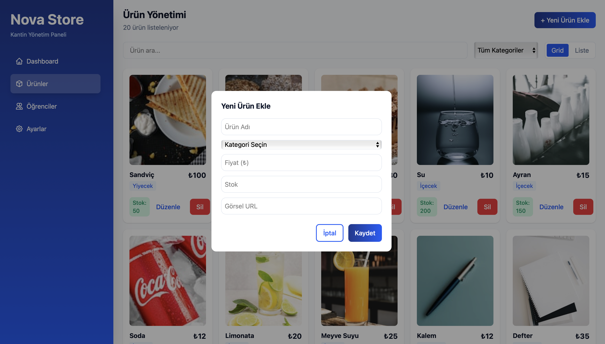
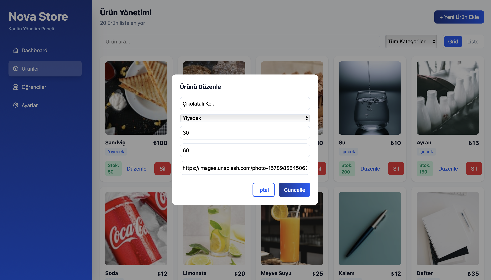
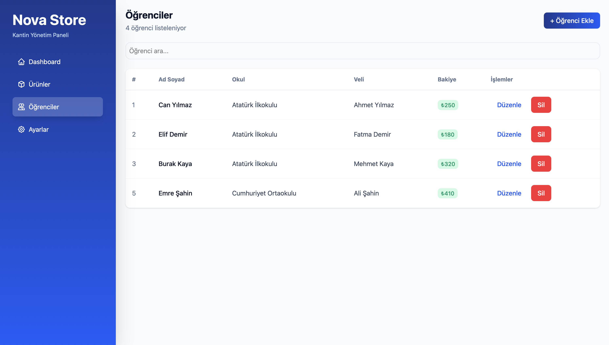
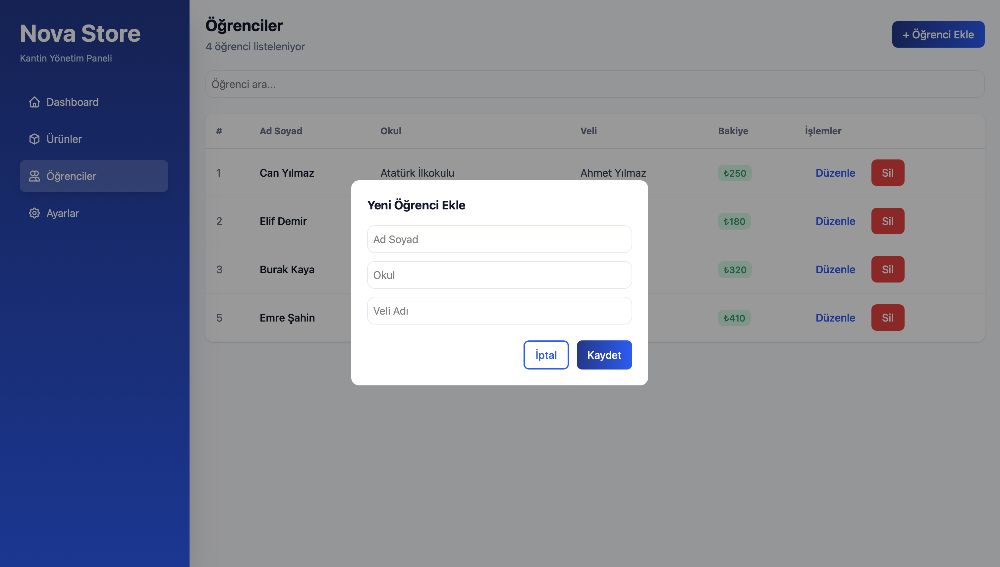
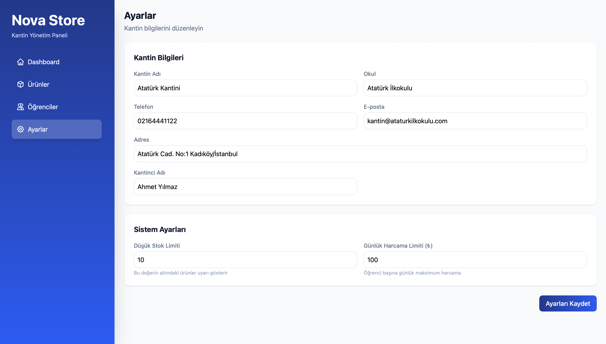

# NovaStore - Modern Web Yönetim Sistemi

NovaStore, ReactJS ve Tailwind CSS kullanılarak geliştirilmiş, ürün ve öğrenci yönetimi için modern bir web uygulamasıdır. Bu proje, Web Geliştirme JavaScript eğitim programı kapsamında geliştirilmiştir.

## Proje Hakkında

Bu uygulama, modern web teknolojileri kullanılarak geliştirilmiş bir yönetim panelidir. Ürün ve öğrenci yönetimi için tüm CRUD (Create, Read, Update, Delete) işlemlerini destekler.

## Teknolojiler

### Frontend Framework & Kütüphaneler
- **React 19.2.4** - Modern UI geliştirme
- **React Router DOM 7.14.0** - Sayfa yönlendirme ve navigasyon
- **Vite 8.0.4** - Hızlı build tool ve development server

### Styling
- **Tailwind CSS 4.2.2** - Utility-first CSS framework
- **Lucide React** - Modern icon kütüphanesi

### HTTP İstemcisi
- **Axios 1.15.0** - API istekleri için

### Development Tools
- **ESLint** - Kod kalitesi ve standartları
- **TypeScript Types** - Type safety

## Özellikler

### Ürün Yönetimi
- Ürün ekleme, güncelleme, silme ve listeleme
- Kategori bazlı filtreleme
- Arama fonksiyonu
- Grid ve liste görünümü
- Ürün görseli yönetimi
- Stok takibi
- Fiyat bilgileri

### Öğrenci Yönetimi
- Öğrenci ekleme, güncelleme, silme ve listeleme
- Öğrenci arama
- Okul ve veli bilgileri yönetimi

### Genel Özellikler
- Responsive tasarım (mobil, tablet, desktop)
- Modern ve kullanıcı dostu arayüz
- Modal yapıları
- Context API ile state yönetimi
- Custom hooks kullanımı
- Animasyonlar ve geçişler

## Proje Yapısı

```
novastore/
├── src/
│   ├── components/          # Yeniden kullanılabilir bileşenler
│   │   ├── Button.jsx       # Buton bileşeni
│   │   ├── Input.jsx        # Input bileşeni
│   │   ├── List.jsx         # Liste görünüm bileşeni
│   │   └── Sidebar.jsx      # Yan menü bileşeni
│   │
│   ├── pages/               # Sayfa bileşenleri
│   │   ├── HomeScreen.jsx   # Ana sayfa/Dashboard
│   │   ├── Products.jsx     # Ürün yönetim sayfası
│   │   ├── Student.jsx      # Öğrenci yönetim sayfası
│   │   ├── Settings.jsx     # Ayarlar sayfası
│   │   └── NotFound.jsx     # 404 sayfası
│   │
│   ├── context/             # Context API yapıları
│   │   ├── ProductContext.jsx
│   │   ├── ProductProvider.jsx
│   │   ├── StudentContext.jsx
│   │   └── StudentProvider.jsx
│   │
│   ├── hooks/               # Custom hooks
│   │   ├── useProduct.jsx   # Ürün işlemleri hook'u
│   │   └── useStudent.jsx   # Öğrenci işlemleri hook'u
│   │
│   ├── assets/              # Statik dosyalar
│   │   ├── config.js        # Konfigürasyon dosyası
│   │   └── hero.png         # Görsel dosyalar
│   │
│   ├── App.jsx              # Ana uygulama bileşeni
│   ├── main.jsx             # Uygulama giriş noktası
│   └── index.css            # Global stiller
│
├── ekrangoruntuleriWeb/     # Uygulama ekran görüntüleri
├── public/                  # Public dosyalar
├── package.json             # Proje bağımlılıkları
├── vite.config.js           # Vite konfigürasyonu
├── tailwind.config.js       # Tailwind CSS konfigürasyonu
└── README.md                # Proje dokümantasyonu
```

## Kurulum

### Gereksinimler
- Node.js (v16 veya üzeri)
- npm veya yarn

### Adımlar

1. Projeyi klonlayın:
```bash
git clone https://github.com/kullanici-adi/novastore.git
cd novastore
```

2. Bağımlılıkları yükleyin:
```bash
npm install
# veya
yarn install
```

3. Geliştirme sunucusunu başlatın:
```bash
npm run dev
# veya
yarn dev
```

4. Tarayıcınızda açın:
```
http://localhost:5173
```

## Kullanım

### Build İşlemi
Production build oluşturmak için:
```bash
npm run build
# veya
yarn build
```

### Preview
Build sonrası önizleme için:
```bash
npm run preview
# veya
yarn preview
```

### Linting
Kod kalitesi kontrolü için:
```bash
npm run lint
# veya
yarn lint
```

## CRUD İşlemleri

### Ürün İşlemleri
- **Ekleme (Create)**: `+ Yeni Ürün Ekle` butonu ile modal açılır
- **Listeleme (Read)**: Ürünler grid veya liste görünümünde listelenir
- **Güncelleme (Update)**: Her ürün kartında düzenle butonu ile modal açılır
- **Silme (Delete)**: Her ürün kartında sil butonu ile silme işlemi yapılır

### Öğrenci İşlemleri
- **Ekleme (Create)**: `+ Öğrenci Ekle` butonu ile modal açılır
- **Listeleme (Read)**: Öğrenciler liste halinde görüntülenir
- **Güncelleme (Update)**: Her öğrenci satırında düzenle butonu ile modal açılır
- **Silme (Delete)**: Her öğrenci satırında sil butonu ile silme işlemi yapılır

## Ekran Görüntüleri

### Ana Sayfa (Dashboard)

*Modern ve kullanıcı dostu dashboard arayüzü*

### Ürün Yönetimi

*Grid görünümde ürün listeleme, filtreleme ve arama*


*Modal ile yeni ürün ekleme ekranı*


*Mevcut ürünü düzenleme modal ekranı*

### Öğrenci Yönetimi

*Öğrenci listesi ve yönetim sayfası*


*Yeni öğrenci ekleme modal ekranı*

### Ayarlar

*Uygulama ayarları ve konfigürasyon sayfası*

## Proje Gereksinimleri Kontrolü

Bu proje, Web Geliştirme JavaScript eğitim programının tüm gereksinimlerini karşılamaktadır:

### Modern JavaScript Kütüphanesi
- ✅ **ReactJS 19.2.4** kullanılmıştır

### Proje Kurulumu
- ✅ Vite ile modern build sistemi kurulmuştur
- ✅ Netlify veya muadili platformlarda deploy edilebilir yapıdadır

### Klasör Yapısı
- ✅ **Components** klasörü mevcut (Button, Input, List, Sidebar)
- ✅ **Pages** klasörü mevcut (HomeScreen, Products, Student, Settings, NotFound)
- ✅ **Context** klasörü mevcut (ProductContext, StudentContext ve Provider'ları)

### CSS Framework
- ✅ **Tailwind CSS 4.2.2** kullanılmıştır
- ✅ Pure CSS ile custom animasyonlar eklenmiştir

### CRUD İşlemleri
- ✅ **Create (Ekleme)**: Ürün ve Öğrenci ekleme işlemleri
- ✅ **Read (Listeleme)**: Ürün ve Öğrenci listeleme işlemleri
- ✅ **Update (Güncelleme)**: Ürün ve Öğrenci güncelleme işlemleri
- ✅ **Delete (Silme)**: Ürün ve Öğrenci silme işlemleri

### Ekran Görüntüleri
- ✅ 7 adet ekran görüntüsü `ekrangoruntuleriWeb/` klasöründe mevcut

### GitHub
- ✅ Proje GitHub'da public repository olarak paylaşılmıştır

## API Entegrasyonu

Proje, mock API kullanmaktadır. Gerçek bir backend ile entegrasyon için:

1. `.env` dosyasında API URL'ini ayarlayın:
```env
VITE_API_URL=https://your-api-url.com
```

2. `src/assets/config.js` dosyasında API endpoint'lerini güncelleyin

## Geliştirici Notları

### Context API Kullanımı
Uygulama, state yönetimi için React Context API kullanmaktadır:
- `ProductContext` ve `ProductProvider`: Ürün verilerini yönetir
- `StudentContext` ve `StudentProvider`: Öğrenci verilerini yönetir

### Custom Hooks
- `useProduct`: Ürün CRUD işlemleri için hook
- `useStudent`: Öğrenci CRUD işlemleri için hook

### Responsive Tasarım
Tailwind CSS breakpoint'leri kullanılarak responsive tasarım sağlanmıştır:
- `sm:` - 640px ve üzeri
- `md:` - 768px ve üzeri
- `lg:` - 1024px ve üzeri

## Deployment

### Netlify ile Deploy
1. GitHub hesabınıza projeyi yükleyin
2. [Netlify](https://www.netlify.com/) hesabınıza giriş yapın
3. "New site from Git" seçeneğini tıklayın
4. Repository'nizi seçin
5. Build ayarlarını yapın:
   - Build command: `npm run build`
   - Publish directory: `dist`
6. Deploy butonuna tıklayın

### Vercel ile Deploy
```bash
npm install -g vercel
vercel
```

## Katkıda Bulunma

1. Fork edin
2. Feature branch oluşturun (`git checkout -b feature/amazing-feature`)
3. Değişikliklerinizi commit edin (`git commit -m 'feat: Add amazing feature'`)
4. Branch'inizi push edin (`git push origin feature/amazing-feature`)
5. Pull Request oluşturun

## Lisans

Bu proje eğitim amaçlı geliştirilmiştir.

## İletişim

Proje Sahibi: Kürşad
- GitHub: [@kullanici-adi](https://github.com/kullanici-adi)

## Teşekkürler

Bu proje, modern web geliştirme teknolojilerini öğrenmek ve uygulamak amacıyla geliştirilmiştir. Eğitim programına katkıda bulunan tüm eğitmenlere teşekkürler.

---

## Proje Çıktıları

Bu proje ile aşağıdaki kazanımlar elde edilmiştir:

- ✅ HTML temellerini uygulama ve geliştirme
- ✅ CSS temellerini uygulama ve Tailwind CSS kütüphanesi kullanımı
- ✅ JavaScript temellerini uygulama ve modern kütüphane kullanımı
- ✅ ReactJS temellerini uygulama ve component-based mimari
- ✅ GitHub hesabına proje yükleme ve versiyon kontrolü deneyimi
- ✅ Gerçek bir frontend projesi geliştirme deneyimi
- ✅ Context API ve Custom Hooks kullanımı
- ✅ Responsive web tasarımı
- ✅ Modern build tools (Vite) kullanımı

---

**Son Güncelleme:** 2026-04-19
**Versiyon:** 1.0.0
**Durum:** Aktif Geliştirme
